# Real-Time Crime Analytics (Lambda Architecture)

**Course**: CS4109 Fundamentals of Big Data Analytics

**Goal**: An end-to-end big-data system that supports **batch analytics** on historical Chicago crime data, **real-time anomaly detection and alerts** on a Kafka stream, and a **single Streamlit dashboard** backed by PostgreSQL and MongoDB.

---

## Contents

- [What problem does it solve?](#what-problem-does-it-solve)
- [Demo at a glance](#demo-at-a-glance-what-the-evaluator-should-see)
- [System architecture](#system-architecture)
- [Data flow pipeline (speed layer)](#data-flow-pipeline-speed-layer)
- [Database flow pipeline](#database-flow-pipeline)
- [Technologies connected together](#technologies-connected-together)
- [Real-time event sequence](#real-time-event-sequence)
- [Evidence: screenshots](#evidence-screenshots)
- [Evaluation](#evaluation-what-was-implemented-and-why-it-matters)
- [Problems faced (and fixes)](#problems-faced-and-how-they-were-solved)
- [How to run](#how-to-run-reproducible-demo-runbook)
- [Key configuration](#key-configuration-knobs)
- [Project structure](#project-structure)
- [Limitations and future improvements](#limitations-and-future-improvements)

---

## What problem does it solve?

City-scale crime data is **large**, **continuously updated**, and used for both **strategic** (long-horizon trends, hotspots) and **tactical** (unusual bursts of incidents) questions.

This project demonstrates a **Lambda Architecture**: Spark materializes authoritative **batch views** into PostgreSQL while Storm consumes Kafka for **low-latency** district-level windows and writes **alerts** to PostgreSQL (structured) and MongoDB (document audit trail). The dashboard reads both paths so evaluators see one cohesive system rather than disconnected demos.

---

## Demo at a glance (what the evaluator should see)

- **Docker Compose stack running**: ZooKeeper, Kafka, Storm (nimbus, supervisor, UI), Spark (master, worker), PostgreSQL, MongoDB, Streamlit dashboard.
- **Batch path**: Spark job completes and refreshes analytics tables used by charts (trends, arrest rates, hotspots).
- **Speed path**: Python producer replaying the CSV into `crime_events` → Storm topology → alerts in Postgres + documents in Mongo.
- **Presentation**: dashboard at `http://localhost:8501` reflecting batch aggregates and streaming alerts.

---

## System architecture

The system follows the Lambda Architecture pattern, combining batch processing for historical analysis and stream processing for low-latency alerts.

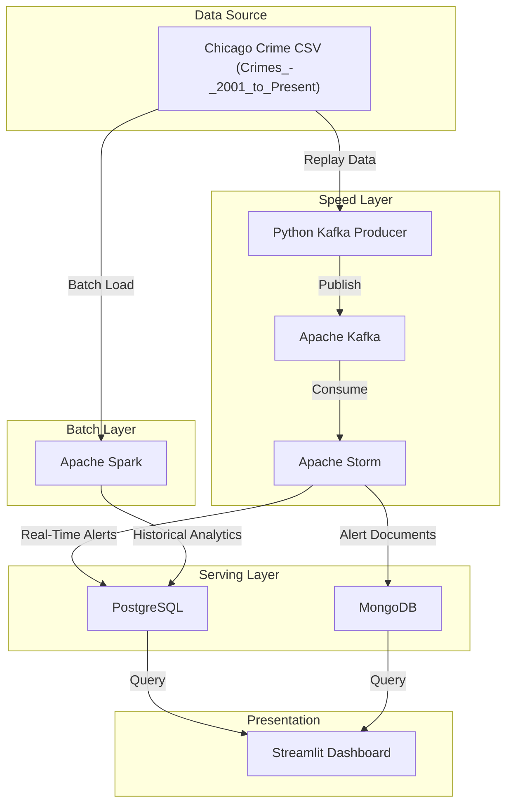

---

## Data flow pipeline (speed layer)

The speed layer parses each event, aggregates by district over a sliding window, tests an anomaly threshold, then persists alerts.

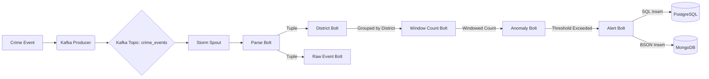

---

## Database flow pipeline

PostgreSQL holds analytics and relational alert rows suited to SQL queries; MongoDB holds raw-style alert documents for flexible inspection.

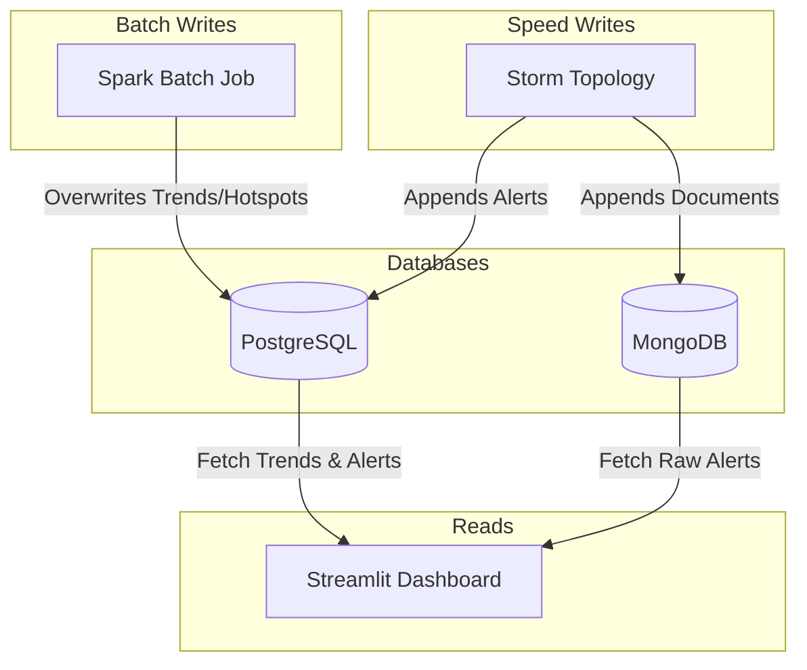

---

## Technologies connected together

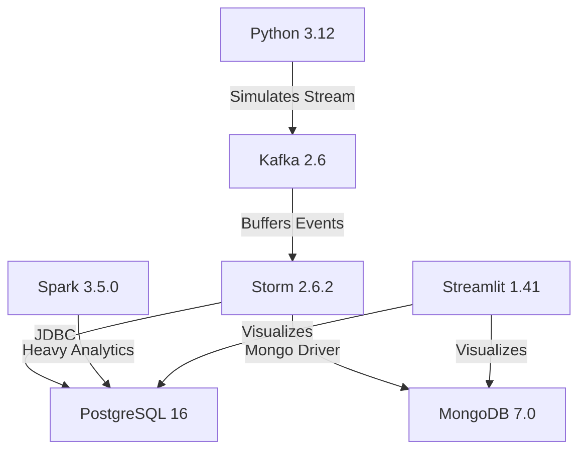

Kafka in Docker uses **Confluent** images (`cp-kafka:7.6.1`); broker API version strings in client logs may still show values like **2.6** from compatibility negotiation. Storm and Spark versions match the topology and Spark UI you run in Compose.

---

## Real-time event sequence

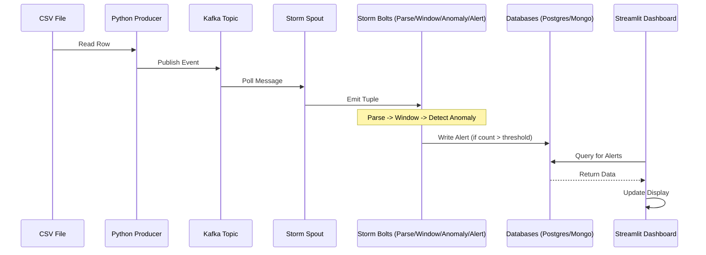

---

## Evidence: screenshots

Artifacts under `Figs/` use descriptive names. Where filenames contain spaces, this README uses **angle-bracket paths** (``), which GitHub-flavored Markdown resolves reliably.

### Full dashboard (single-screen demonstration)

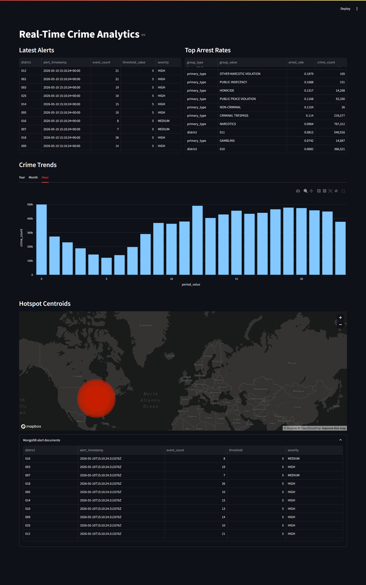

### Storm UI (topology health and tuple flow)

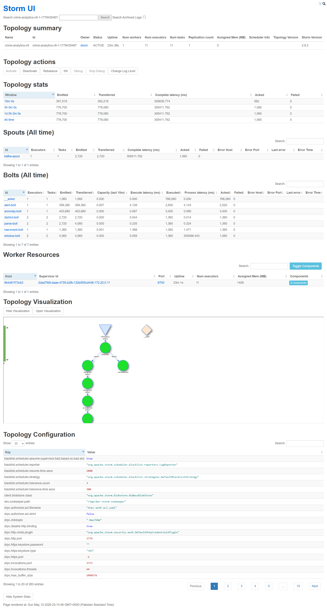

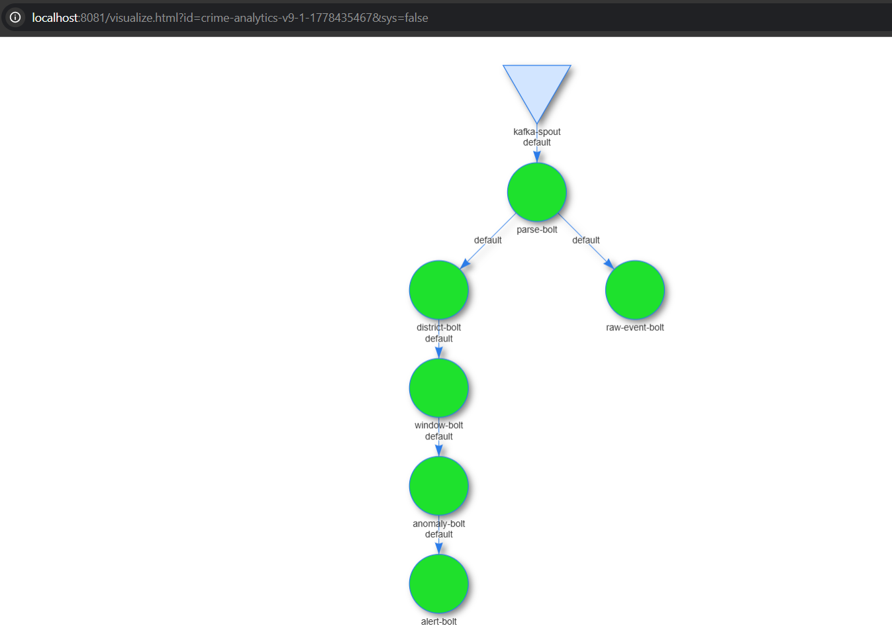

### Spark UI (batch application execution)

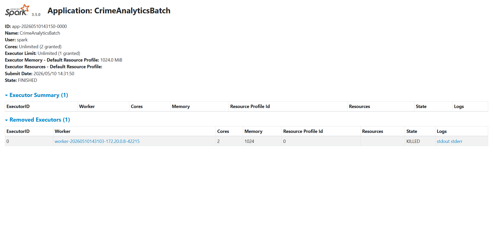

### Infrastructure proof (Docker containers)

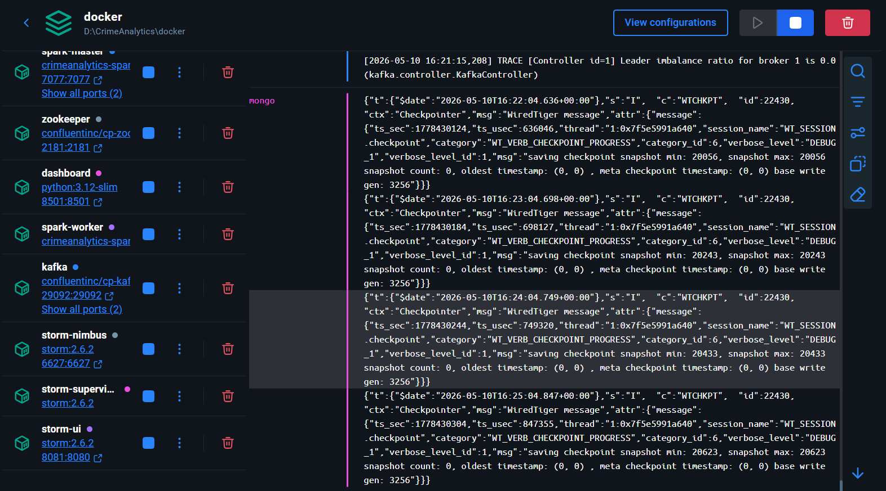

### Batch outputs (analytics visuals)

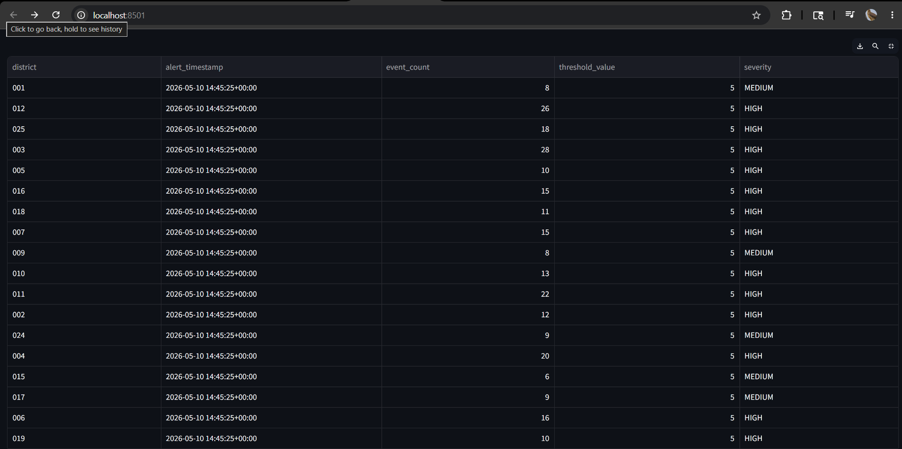


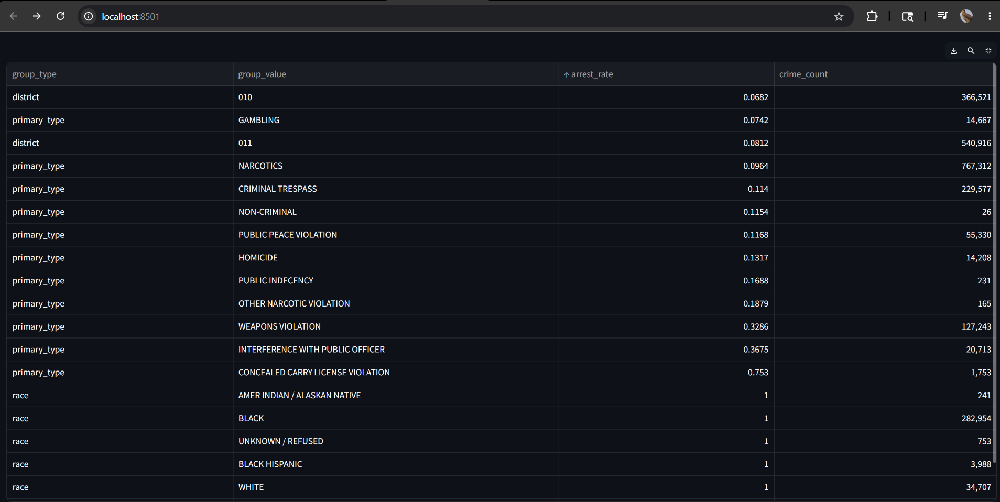


### Streaming outputs (Mongo alert documents)


---

## Evaluation (what was implemented and why it matters)

### Batch layer (Spark)

- **Role**: Offline computation over the full historical dataset—time trends, hotspots, arrest-rate style summaries—and **write-through** into PostgreSQL for fast dashboard reads.
- **Why it fits**: Dataset scale and aggregation depth suit a batch engine; results are refreshed explicitly when you submit the job (reproducible for grading).

### Speed layer (Kafka + Storm)

- **Role**: Continuous consumption of `crime_events`, **sliding-window** counts per district, **threshold-based** anomalies, JDBC inserts to Postgres and document inserts to MongoDB.
- **Why it fits**: Storm’s spout/bolt model maps directly onto parse → route → window → detect → persist; Kafka decouples the producer from storm processing rates.

### Data quality

- The Python producer **skips rows missing required fields** (e.g. latitude/longitude) so bad records do not corrupt streaming or mislead hotspots.

---

## Problems faced (and how they were solved)

### Spark `--packages` / Ivy cache in the container

**Symptom**: `spark-submit` with `org.postgresql:postgresql` failed when Ivy tried to write under a missing or non-writable cache path.

**Fix**: Use a writable Ivy root, for example `--conf spark.jars.ivy=/tmp/.ivy2`, as reflected in the runbook below.

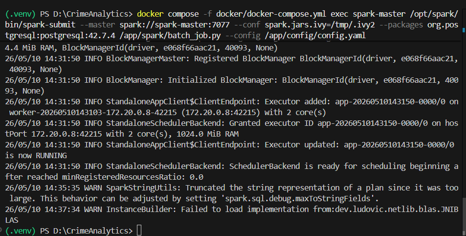

### “Ghost alerts” (threshold vs simulation rate)

**Symptom**: Dashboard alert tables stayed empty despite a live Kafka producer.

**Cause**: Threshold too high for the replay pattern (many districts splitting the traffic).

**Fix**: Tune Docker env for Storm (see [`docker/docker-compose.yml`](docker/docker-compose.yml)): e.g. `WINDOW_SIZE_SECONDS=300`, `SLIDE_INTERVAL_SECONDS=10`, `ANOMALY_THRESHOLD=5`.

### Kafka consumer lock when resubmitting topologies

**Symptom**: New topology submits but consumes nothing.

**Cause**: Older topology instance still attached to the **same consumer group**; with a single partition, only one consumer receives messages.

**Fix**: Kill superseded topologies (`storm kill <name>`) before relying on a new submission, or use distinct consumer identities per graded run.

---

## How to run (reproducible demo runbook)

### Prerequisites

- Docker Desktop on Windows  
- Python 3.12 + project venv (for the local Kafka producer)

### 1. Start infrastructure

```powershell
docker compose -f docker/docker-compose.yml up -d
```

### 2. Batch analytics (Spark → PostgreSQL)

```powershell
docker compose -f docker/docker-compose.yml exec spark-master `
  /opt/spark/bin/spark-submit `
  --master spark://spark-master:7077 `
  --conf spark.jars.ivy=/tmp/.ivy2 `
  --packages org.postgresql:postgresql:42.7.4 `
  /app/spark/batch_job.py `
  --config /app/config/config.yaml
```

### 3. Submit Storm topology

```powershell
docker compose -f docker/docker-compose.yml exec storm-nimbus `
  storm jar /storm-app/target/crime-storm-topology-1.0.0.jar `
  edu.nu.crimeanalytics.topology.CrimeAnalyticsTopology `
  crime-analytics-v9
```


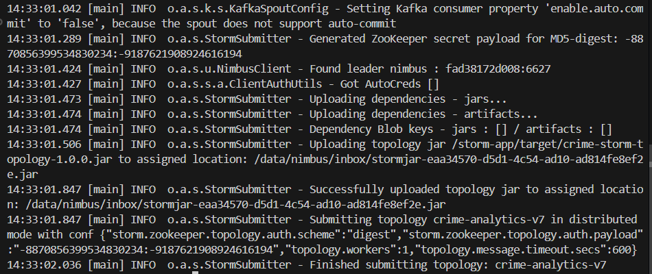

### 4. Stream events (host → Kafka)

```powershell
python kafka/producer.py --config config/config.yaml
```

### 5. URLs

| Service | URL |
|--------|-----|
| Streamlit | http://localhost:8501 |
| Storm UI | http://localhost:8081 |
| Spark Master UI | http://localhost:8080 |

---

## Key configuration knobs

| Where | What |
|--------|------|
| [`docker/docker-compose.yml`](docker/docker-compose.yml) | `WINDOW_SIZE_SECONDS`, `SLIDE_INTERVAL_SECONDS`, `ANOMALY_THRESHOLD`, JDBC and Mongo URIs for Storm |
| [`config/config.yaml`](config/config.yaml) | Kafka bootstrap, topic, DB endpoints, dashboard wiring |

---

## Project structure

```
config/          # runtime YAML (connections, topic, etc.)
dashboard/       # Streamlit app
db/              # Postgres + Mongo init scripts
docker/          # Compose, Spark image, Storm config
kafka/           # CSV replay producer
spark/           # PySpark batch job
storm/           # Java topology (spouts/bolts)
Figs/            # Report screenshots and terminal evidence
```

---

## Limitations and future improvements

- **Operational metrics**: surface Kafka lag, Storm bolt latency, and end-to-end alert delay for quantitative streaming evaluation.
- **Scale-out**: increase topic partitions and Storm workers for higher throughput tests.
- **Richer anomalies**: baseline per district/time-of-week instead of one global threshold; optional seasonal adjustment.
- **Geospatial refinement**: grid-based hotspots (e.g. H3) and reproducible CRS handling for centroid maps.
